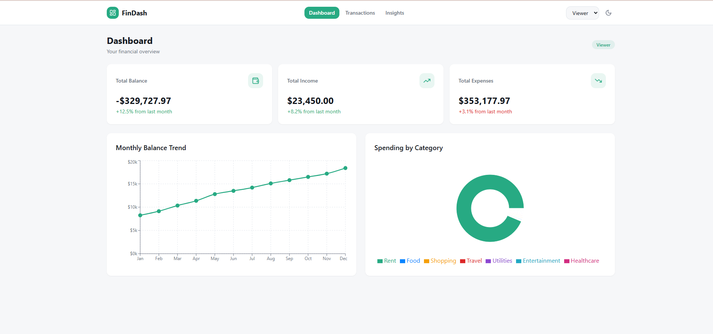
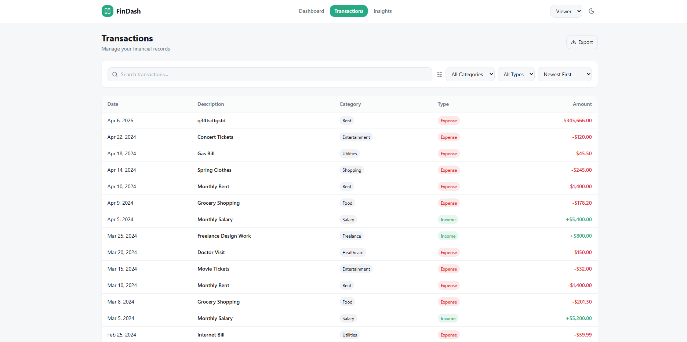
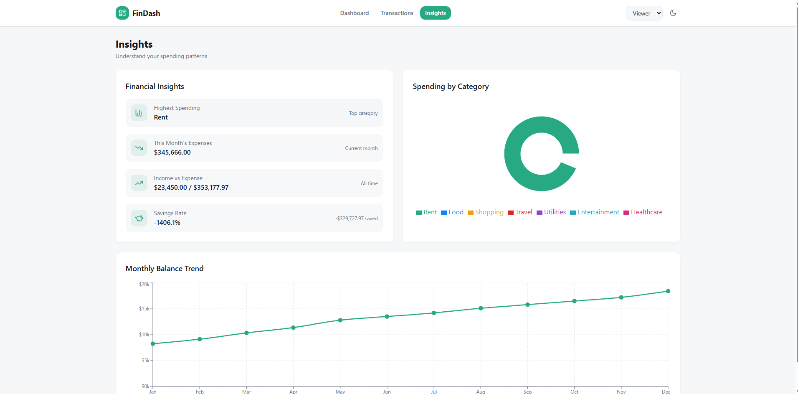

TODO: Document project here
# FinDash — Finance Dashboard UI

A clean, responsive, frontend-only finance dashboard built with modern web technologies. Users can view financial summaries, explore transactions, understand spending patterns, and simulate role-based access control.

🔗 **Live Demo:** (https://id-preview--30a9e670-6d53-4062-bbfd-5ebfd30b9f66.lovable.app)

---

## 📸 Screenshots

The app features a Dashboard overview, Transactions management, and Insights page — all with dark mode support.
<h2 align="center">📸 Project Screenshots</h2>

<p align="center">
  
  
</p>

<p align="center">
  
</p>
---

## 🛠 Tech Stack

| Technology | Purpose |
|---|---|
| **React 18** | UI library (component-based architecture) |
| **Vite 5** | Build tool & dev server (fast HMR) |
| **TypeScript 5** | Type safety across the codebase |
| **Tailwind CSS 3** | Utility-first CSS framework for styling |
| **Recharts** | Charting library (line chart, pie chart) |
| **React Context API** | Centralized state management |
| **LocalStorage** | Client-side data persistence |
| **Lucide React** | Icon library |
| **Sonner** | Toast notifications |
| **shadcn/ui** | Pre-built accessible UI components |

---

## 🎯 Features Implemented

### 1. Dashboard Overview
- **3 Summary Cards** showing Total Balance, Total Income, and Total Expenses — each with an icon, formatted currency amount, and percentage change indicator.
- **Balance Trend Line Chart** (Jan–Dec) using Recharts with a responsive container, showing monthly balance progression.
- **Spending Breakdown Pie Chart** showing expenses grouped by category (Food, Rent, Shopping, Travel, Utilities, etc.).

### 2. Transactions Management
- **Transactions Table** with columns: Date, Description, Category, Type (Income/Expense), Amount, and Actions.
- **Search** by description (real-time filtering).
- **Filter** by Category and Type (Income/Expense).
- **Sort** by Date or Amount (ascending/descending).
- **Add Transaction** form (Admin only) with fields for date, description, category, type, and amount.
- **Edit & Delete** transactions inline (Admin only).
- **Export to CSV** — downloads all transactions as a `.csv` file.

### 3. Role-Based UI (Frontend Simulation)
- **Role Switcher** dropdown in the header toggles between `Admin` and `Viewer`.
- **Viewer Role:** Read-only access — can view all data, charts, and transactions but cannot add, edit, or delete.
- **Admin Role:** Full access — can add new transactions, edit existing ones, and delete records.
- Implementation uses **conditional rendering** (`{isAdmin && <button>...}`) — no backend auth is involved.

### 4. Insights Section
- **Highest Spending Category** — dynamically calculated from transaction data.
- **Total Expenses This Month** — filters and sums expenses for the current period.
- **Income vs Expense Comparison** — side-by-side display with visual indicators.
- **Savings Rate** — calculated as `((income - expenses) / income) * 100`.
- All insights are **derived from actual transaction state**, not hardcoded.

### 5. State Management (React Context API)
The app uses a single `FinanceContext` that manages:
- `transactions[]` — the list of all financial records
- `filters` — search term, category, type, sort field, and sort order
- `role` — current user role (`admin` | `viewer`)
- `darkMode` — theme toggle state
- Derived values: `totalBalance`, `totalIncome`, `totalExpenses`, `filteredTransactions`

All components consume this context via the `useFinance()` custom hook, keeping state logic centralized and avoiding prop drilling.

### 6. Dark Mode
- Toggle button in the header switches between light and dark themes.
- Implemented via Tailwind's `dark` class on the `<html>` element.
- Preference is saved in `localStorage` and restored on page load.

### 7. LocalStorage Persistence
- Transactions, selected role, and dark mode preference persist across browser sessions.
- On first load, mock data is used as the default; subsequent changes are saved automatically.

### 8. Toast Notifications
- Success/error toasts appear when adding, editing, or deleting transactions, and when exporting CSV.

---

## 📁 Project Structure

```
src/
├── components/          # Reusable UI components
│   ├── BalanceChart.tsx      # Line chart (monthly balance trend)
│   ├── SpendingChart.tsx     # Pie chart (spending by category)
│   ├── SummaryCard.tsx       # Dashboard summary card
│   ├── InsightsPanel.tsx     # Financial insights display
│   ├── TransactionTable.tsx  # Transactions data table
│   ├── TransactionFilters.tsx# Search, filter, sort controls
│   ├── TransactionForm.tsx   # Add/Edit transaction form
│   ├── Header.tsx            # Navigation bar with role switcher
│   └── ui/                   # shadcn/ui base components
├── context/
│   └── FinanceContext.tsx     # React Context for global state
├── data/
│   └── mockData.ts           # Mock transactions & monthly data
├── pages/
│   ├── Index.tsx              # Entry page
│   ├── DashboardPage.tsx      # Main dashboard with all sections
│   └── NotFound.tsx           # 404 page
├── types/
│   └── finance.ts             # TypeScript interfaces & types
├── utils/
│   └── finance.ts             # Currency formatting, CSV export
└── hooks/                     # Custom React hooks
```

---

## 🚀 How to Run Locally

```bash
# 1. Clone the repository
git clone <your-repo-url>
cd <project-folder>

# 2. Install dependencies
npm install

# 3. Start development server
npm run dev

# 4. Open in browser
# Visit http://localhost:5173
```

---

## 🏗 Build for Production

```bash
npm run build
# Output is in the `dist/` folder
```

---

## 🌐 Deployment (Netlify)

| Setting | Value |
|---|---|
| **Build command** | `npm run build` |
| **Publish directory** | `dist` |
| **Node version** | 18+ |

Steps:
1. Push code to GitHub.
2. Connect the repo in Netlify.
3. Set the build settings above.
4. Deploy.

---

## 🔄 How Role Switching Works

1. The header contains a `<select>` dropdown with two options: **Admin** and **Viewer**.
2. Selecting a role updates the `role` state in `FinanceContext`.
3. Components check `role === "admin"` to conditionally render action buttons (Add, Edit, Delete).
4. The role is persisted in `localStorage`, so it survives page refreshes.
5. This is purely a **frontend simulation** — there is no authentication or authorization backend.

---

## 🧠 Key Technical Decisions

| Decision | Rationale |
|---|---|
| **React Context over Redux** | Simpler for a small-medium app; avoids extra dependencies |
| **Recharts** | Lightweight, React-native charting with good defaults |
| **Tailwind CSS** | Rapid styling with utility classes; consistent design system |
| **TypeScript** | Catches type errors at compile time; better DX |
| **LocalStorage** | Simple persistence without a backend; suitable for demo/assignment |
| **shadcn/ui** | Accessible, customizable component primitives |

---

## 📝 Notes for Evaluation

- **No backend** — all data is mock/static and managed client-side.
- **Clean component architecture** — each component has a single responsibility.
- **Responsive design** — tested on desktop, tablet, and mobile viewports.
- **Accessibility** — semantic HTML, proper labels, keyboard navigation support via shadcn/ui.
- **State centralization** — all business logic lives in `FinanceContext`, components are purely presentational where possible.

---

##  License

This project was built for assignment purpose.
By: Mayank Katyayan

## Connect with Me

[](https://www.linkedin.com/in/mayankkat/)
